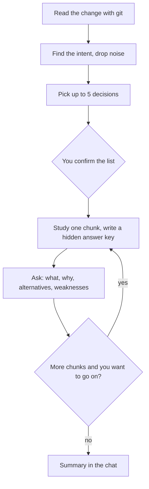

# How branch-interview works

The whole plugin is one instruction file: `skills/branch-interview/SKILL.md`. There are no scripts, agents, or saved state. Claude reads the change with plain `git` commands and runs the interview in the conversation.

## The idea

You wrote (or had an AI write) some code. Before you open a PR, the skill checks that you understand it. It picks the decisions in your change and asks about each one, one question at a time: what it does, why it is there, why not an obvious alternative, and where it is weak. If you do not know, it gives you a hint instead of the answer. Only your own words count.

## A session

### 1. Scope

You choose what to talk about: your branch against its base (`main`, then `master`, then `origin/HEAD`, or `--base <ref>`), the last commit, uncommitted work, or chosen files. Claude reads the log and the diff, and finds the intent of the change in commit messages and in docs the change edits. Lock files, generated files, binaries, renames, and formatting-only edits are noise and are skipped.

If the diff has secrets, files committed by accident, or meaningless commit messages, you hear about it at once.

### 2. Decisions, not files

A **chunk** is one engineering decision, not one block of changed lines. It can span several files: a new module, its wiring, and its config value are one chunk.

Each change is either a **decision** or **support**:

- A **decision** records a choice that could have been made differently and that affects someone outside the change. It changes an interface or behavior others depend on, stored data, how the system is deployed or run, a pattern others will follow, who is responsible for what, or it works around a problem instead of fixing it.
- **Support** only follows from a decision elsewhere: tests that pin it, docs that describe it, regenerated files, mechanical renames, developer tooling.

The kind depends on the role of the change, not on the file type. A config value that changes runtime behavior is a decision.

You see at most 5 decisions, the riskiest first, with one line on why each was picked. Other decisions are listed on one line below. You can reorder, drop, or add anything. `--all` lists every decision. Support is never asked about directly, but it feeds the questions: "what does this test actually catch?"

### 3. The answer key

Before asking about a chunk, Claude studies it: callers, nearby code, tests, docs, commit messages. It writes a hidden answer key for the four axes, with at least one real alternative and one real weakness. It never shows the key before you answer.

### 4. The questions

Four axes per chunk:

1. **What**: what the code does and what triggers it.
2. **Why**: what problem it solves, what breaks without it.
3. **Alternatives**: "Why not <X> here?" for one real alternative.
4. **Weaknesses**: edge cases, races, coupling, unbounded growth, debt.

One question per message. No yes/no questions, and no question that gives away its answer.

If your answer is partial, Claude says which part is still open and gives a leading question or a place to look. On a second miss, or when you say "explain", it explains in full and asks you to restate it in your own words. "Yes, I agree" does not count.

Your own view wins when the code agrees with it. If you name a trade-off or weakness the key missed, it counts. If a real weakness worth fixing comes up, you are invited to rewrite the chunk yourself; Claude never edits code.

### 5. Summary

At the end, or when you say "stop", you get a summary in the chat: a status per chunk (on your own, with a hint, rewritten, skipped, not reached), what to reread, weaknesses you chose to keep (worth mentioning in the PR), and any problems found in the diff. Nothing is written to disk.
