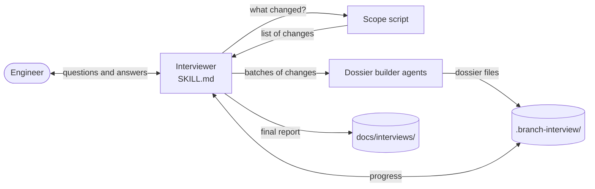
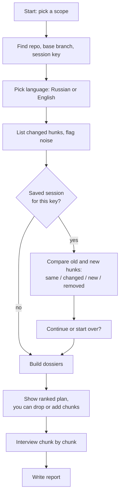
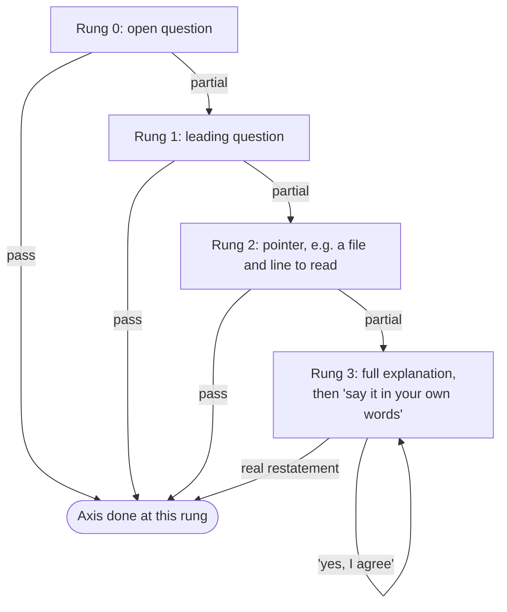
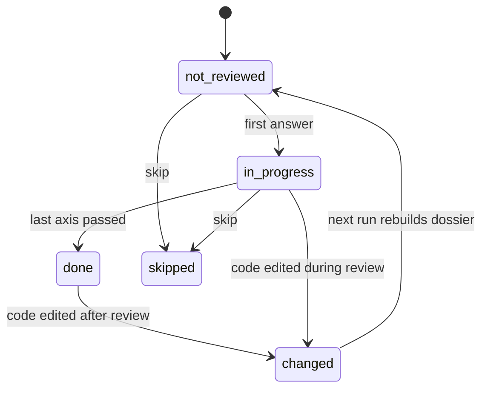

# How branch-interview works

This page explains what happens from the moment you start an interview to the moment the report lands in your repository. It describes the design in plain words. For the exact rules, read the files it points to.

## The idea in one paragraph

You wrote (or had an AI write) some code. Before you push it, the skill checks that you actually understand it. It finds the parts of your change that matter most, then asks you about each part, one question at a time: what it does, why it is there, what else you could have done, and where it is weak. If you do not know, it does not hand you the answer. It gives you a series of hints, each a little stronger than the last. Only your own words count as proof that you own the code. At the end you get a report with your answers and a list of things worth rereading.

## The moving parts

The plugin has four pieces. Each one has a single job.

| Piece | File | Job |
|-------|------|-----|
| Interviewer | `skills/branch-interview/SKILL.md` | Runs the whole session: setup, questions, hints, saving progress, the report. This is the "brain". |
| Scope script | `skills/branch-interview/scripts/scope.sh` | Does the mechanical work that must be exact and repeatable: which lines changed, how to name each change, which changes are noise. No judgement, no AI. |
| Dossier builder | `agents/dossier-builder.md` | Studies a batch of changes and writes a private "cheat sheet" (a dossier) for each meaningful piece: what it does, why, alternatives, weaknesses, possible bugs, and ready-made questions with hints. |
| Report template | `skills/branch-interview/report-template.md` | The shape of the final report, with headings in English and Russian. |

The split is deliberate. Anything that must give the same answer every time (which lines changed, whether a change is the same one you already reviewed) lives in the script. Anything that needs understanding (what the code means, how good an answer is) lives with the AI.

## Key terms

- **Scope.** Which changes to interview you about. There are four choices: your whole branch compared to where it split from `main`, only the last commit, only uncommitted work, or a list of chosen files.
- **Hunk.** One continuous block of changed lines in one file, as git sees it.
- **Hunk hash.** A fingerprint of a hunk's content. It ignores trailing spaces and line numbers, so moving a hunk up or down in a file keeps the same fingerprint. Editing its content gives a new one. This is how the skill notices that code changed after you were asked about it.
- **Noise.** Changes that are not worth asking about: lock files, generated files, whitespace-only edits, pure renames, and binary files. They are listed, not questioned.
- **Chunk.** One piece of meaning, such as one function or one mechanism. A chunk can hold several hunks, even across files. You are interviewed chunk by chunk, not hunk by hunk.
- **Dossier.** The private notes for one chunk. You never see it. The interviewer uses it to ask questions, judge answers, and pick hints.
- **Axis.** One of the four things asked about each chunk: what, why, alternatives, weaknesses.
- **Rung.** How much help you needed on an axis, from 0 (none) to 3 (full explanation).

## A session from start to finish

### 1. Setup

You choose the scope. The script then answers a few basic questions: are we inside a git repository, which branch is the base, and what "key" names this session. The key is built from the branch name and the scope, so interviewing the same branch again finds the same saved session.

The skill makes sure its working folder, `.branch-interview/`, is in `.gitignore`. It then picks the language. If earlier reports exist, it reuses their language. Otherwise it asks. From then on, every message stays in that language, even if you answer in the other one.

### 2. Finding the changes

The script lists every hunk in the scope, with its fingerprint, its file and lines, how many lines were added and removed, and whether it is noise. If nothing changed, or only noise changed, the session ends here. If the change is very large, you get a warning, but the session goes on.

### 3. Resuming

If you interviewed this scope before, the script compares the saved fingerprints with the current ones. Each old hunk is either the same, changed (its content differs but it overlaps the same lines), new, or removed. Chunks you already passed stay passed if their code did not change. Changed chunks are reset and get a fresh dossier. You then choose to continue or to start over.

### 4. Building dossiers

The changes are grouped by top-level folder into batches of up to 400 changed lines. Each batch goes to a dossier builder. By default, up to five builders run in parallel as separate agents, so the heavy reading does not fill the main conversation.

A builder:

1. reads each hunk and the code around it;
2. groups hunks into chunks of meaning;
3. scores each chunk from 1 to 5 on importance (public API, data, security, money, concurrency), complexity, and doubt (smells, possible bugs, missing tests, anything that can grow without a limit);
4. writes one dossier per chunk, with a ready question for each axis, the key points of a good answer, and three hints of rising strength.

The builder looks for evidence of *why* the code exists in commit messages, tests, and callers. When it has no evidence, it says so instead of guessing. It may only read the repository and write inside the dossier folder.

There is also an **inline mode** (`--inline`). Here the interviewer builds the dossiers itself, with no agents. This is quicker on small changes. The downside is that the dossiers pass through the main conversation, so the answers are visible in the tool output. The skill warns you not to expand them. On large changes it offers to switch back to agents.

If an agent fails twice on a batch, the interviewer writes those dossiers itself and notes that in the saved state.

### 5. The plan

Chunks are ranked by the total of their three scores. You see a numbered list of `file:lines` with a one-line reason for each. Low-scoring chunks and noise are folded into single lines at the end. You can drop chunks or add any lines you want to be asked about.

### 6. The interview

For each chunk, the interviewer shows you the code and goes through the four axes in order. For each axis it climbs a **hint ladder**, one rung at a time, and stops as soon as you give a passing answer.

**What counts as passing.** The answer must not say anything wrong about the code. For "what" and "why", it must cover every key point. For "alternatives" and "weaknesses", more than half of them is enough. A correct point said with "I think" still counts. "I don't know" does not.

**What the interviewer does after a partial answer.** It says, in one sentence, which part of the question is still open, using only the words of the question itself. Then it asks one new question that describes a situation without naming the missing detail. The rule is strict: a hint must never contain its own answer.

**What the interviewer does after a passing answer.** One short acknowledgement, no praise. For alternatives and weaknesses, it then lists the points you did not mention, and any possible bugs from the dossier, as plain information with a file and line. You are not asked to fix anything. Then it moves on.

**Your own view wins when it fits the code.** The dossier is a hint, not the truth. If you explain the intent differently, and the code is consistent with your explanation, the axis passes. The difference is recorded as a "disagreement". A correct weakness or alternative that the dossier missed also counts.

**Conversation rules.** Each message asks exactly one question. No yes/no questions. No "is it right that...". A bare "yes, I agree" after an explanation is not a restatement, so you are asked again to say it in your own words.

**Commands.** You can say these at any time, in either language:

- `explain` / `объясни`: get the full explanation now, then restate it. Asking "just tell me the answer" counts as the same thing.
- `skip` / `пропусти`: skip the current axis, or the whole chunk if said at its start.
- `stop` / `хватит`: end now and write the report.

### 7. Saving progress

The interviewer saves after **every** answer, before it replies. The saved state lives in `.branch-interview/<key>/` and has two parts: a table of hunk fingerprints and which chunk each belongs to, and a readable state file with, for each chunk, its scores, status, rung per axis, and your passing answers word for word. Because it saves first and talks second, a dropped session loses nothing. The next run picks up where you left off.

### 8. The report

When all chunks are done, or you say stop, the skill checks once more whether any reviewed code changed since you were asked about it, including uncommitted edits. Then it writes `docs/interviews/<key>.md`.

The report has:

- a summary line: how many chunks you knew outright, needed hints for, or needed a full explanation for, and how many you skipped (each chunk counts by its weakest axis);
- chunks not reviewed yet, and chunks changed after review;
- **gaps**: every axis where you needed rung 2 or 3, so you know what to reread;
- findings (possible bugs) and disagreements with the dossier;
- your answers per chunk, word for word.

The report never contains the interviewer's explanations, only your words. The skill does not commit it. Committing it, so reviewers can see it, is your choice.

## Where things are stored

| Location | Content | In git? |
|----------|---------|---------|
| `.branch-interview/<key>/hunks.tsv` | Fingerprint of each hunk and its chunk | No (ignored) |
| `.branch-interview/<key>/state.md` | Progress, rungs, your answers | No (ignored) |
| `.branch-interview/<key>/dossiers/` | One private dossier per chunk | No (ignored) |
| `docs/interviews/<key>.md` | Final report | Only if you commit it |

## Design choices worth knowing

- **Deterministic core, AI on top.** Fingerprints, noise rules, and change detection are plain shell and give the same result every run. This makes resume and "changed after review" reliable.
- **Dossiers stay hidden.** If you could see the dossier, you could read the answers back. So the interviewer never shows or quotes it.
- **Hints before answers.** The goal is to make you find the answer, because that is what shows ownership. The full explanation is always available on request, but it still ends with you restating it.
- **Mentor, not examiner.** No trick questions, no praise inflation, no demand to rewrite code. Weak spots are reported as information.
- **Runs on old bash.** The script works on bash 3.2, the version macOS ships, so the plugin needs nothing extra installed.
