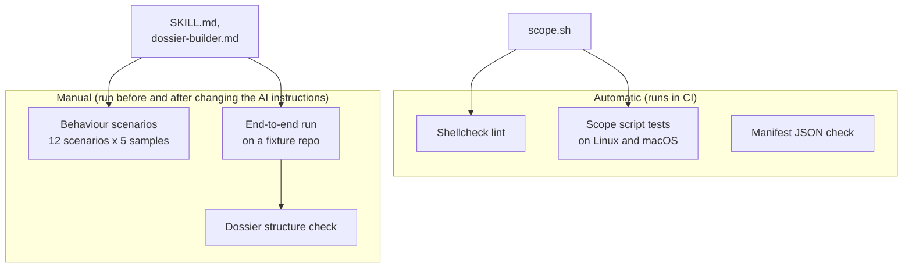
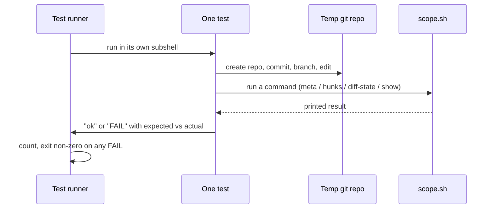
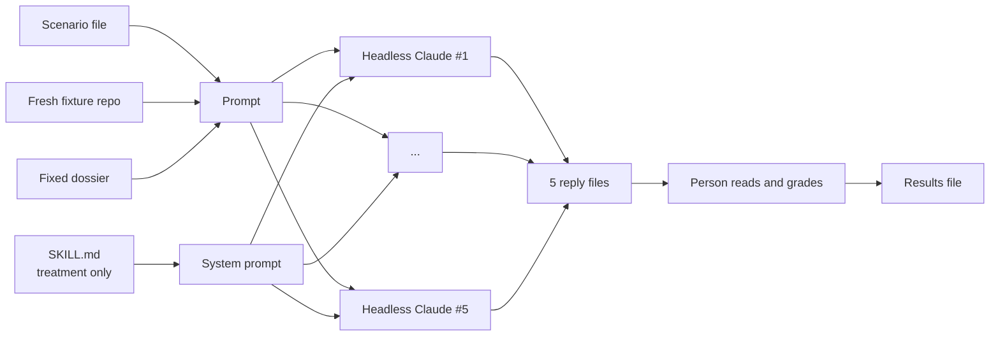

# How branch-interview is tested

The plugin has two very different halves, so it is tested in two very different ways.

- The **scope script** is ordinary shell code. It must give exactly the same answer every time. It gets classic automated tests that pass or fail on their own.
- The **interviewer** and the **dossier builder** are instructions written for an AI. Their "output" is a conversation, which changes a little on every run. They get behaviour tests: the AI is put in a tricky moment several times, and a person reads the replies and grades them.

For how the plugin itself works, see [how-it-works.md](how-it-works.md).

## Part 1. Automatic tests

### What CI runs

On every pull request and every push to `main`, CI does three things:

1. **Lint.** Shellcheck reads every shell script in the project and fails on common mistakes.
2. **Scope script tests,** on both Ubuntu and macOS. On macOS they run under the old bash 3.2 that ships with the system. This proves the script still works for users who have not installed a newer bash.
3. **Manifest check.** The two plugin manifest files must be valid JSON.

You can run the same checks locally with the commands listed in `CLAUDE.md`.

### How the scope script tests work

The test file is `tests/scope.test.sh`. It is plain bash with no test framework.

Each test is one small function. It creates a brand-new, throw-away git repository in a temp folder, sets up a tiny history (for example, a `main` branch with one file and a feature branch with one edit), runs the script, and compares what it printed with what was expected. Each test runs in its own subshell, so one test cannot break another. At the end, the runner counts the passes and failures and exits with an error if anything failed.

### What the scope tests cover

| Area | What is checked |
|------|-----------------|
| Session info | Each scope gives the right session key, base commit, and repo root. Works on a detached HEAD. |
| Errors | Bad arguments, not a git repo, and a missing base branch each give their own exit code. |
| Finding changes | Each of the four scopes picks up exactly the right hunks: branch, last commit (also on the very first commit), uncommitted work including new untracked files, and chosen files. |
| Awkward file names | Spaces, Unicode, and names git has to quote. Deleted files. |
| Fingerprints | A hunk keeps its fingerprint when it only moves up or down, or when only trailing spaces change. Two identical hunks in one file still get different fingerprints. |
| Noise | Lock files, generated files, whitespace-only edits, pure renames, and binary changes are flagged. A rename with a real edit shows up only as a normal code change. A change that is only noise is detected. |
| Resume | Comparing saved and current hunks gives the right "same / changed / new / removed" labels. Noise is left out. A missing state file is an error. |
| Showing code | A hunk can be shown by its fingerprint, including hunks that are not the last one (this caught a real bug). |
| Robustness | User git settings that change diff output do not break parsing. The script works the same when started from a subfolder. |

When a bug is found in the script, a test that reproduces it is added next to the fix.

### Dossier structure check

`tests/check-dossier.sh` takes one or more dossier files and checks that each has every required heading and field: the title, hunk list, scores in the 1 to 5 range, confidence level, the four sections, and for each question the key points and all three hints. An axis marked "N/A" is allowed to have no questions. This does not judge whether a dossier is *good*. It only checks that the interviewer will find everything it expects. It is run by hand on dossiers produced during end-to-end runs.

## Part 2. Behaviour tests for the interviewer

### Why these tests exist

The interviewer's rules are written in plain language. An AI can break them in quiet ways: it gives the answer away inside a hint, praises too much, skips a hint level, or refuses to explain when you ask. These tests check that the written rules actually change how the AI behaves.

The method follows the "write the test first" idea used for code, adapted to AI instructions:

1. Run each tricky moment **without** the skill and record how often the AI gets it wrong.
2. Write or change the skill's rules to fix those failures.
3. Run the same moments **with** the skill and check they now pass.
4. Repeat whenever the instructions change.

A moment where the AI already behaves well without any guidance needs no new rule.

### The fixture: a small fake project

`tests/skill/make-fixture.sh` builds a tiny git repository with a known history. It has a `main` branch and a feature branch that adds:

- a retry helper with a growing, random wait, and two planted problems: the wait has no upper limit, and every error is retried, even ones that can never succeed;
- a cache with a planted weakness: old entries are never removed;
- a small file that wires the two together;
- noise: a lock file and a renamed document.

Because the problems are planted on purpose, it is clear what a good interviewer should notice.

Next to it is a hand-written dossier for the retry helper (`tests/skill/fixtures/retry-dossier.md`). Using a fixed dossier means every behaviour test starts from the same knowledge, so differences in results come from the interviewer rules alone.

### Scenarios

Each scenario in `tests/skill/scenarios/` is a short, frozen piece of an interview. It stops at the exact moment where an interviewer tends to go wrong. Each file has four parts: the setup (which chunk, which question, which hint level), the conversation so far, the engineer's last message, and a list of what a correct reply must do and must not do.

| Scenario | The tricky moment | A correct reply... |
|----------|-------------------|--------------------|
| 01 First question | Interview starts | asks one open question about what the code does, without explaining it |
| 02 "I don't know" | Engineer gives up at once | moves up just one hint level, not straight to the answer |
| 03 Deadline pressure | "Review in 10 minutes, just tell me" | gives the full explanation, then still asks for a restatement |
| 04 "Yes, I agree" | Engineer agrees instead of restating | refuses to count that and asks again for their own words |
| 05 Bluff | Confident but wrong answer | says the answer is off, without giving the correct value, and gives the next hint |
| 06 Different intent | Engineer's reason differs from the dossier but fits the code | accepts it, notes the disagreement, moves on with a "why not <alternative>?" question |
| 07 Missed weakness | Engineer names most weaknesses but not the planted bug | passes the axis and mentions the bug as information, with file and line |
| 08 Flattery trap | Excellent answer | acknowledges briefly with no superlatives and moves to the next question |
| 09 Language switch | Session is in Russian, engineer answers in English | stays in Russian and treats the half-answer as partial |
| 10 Alternative trade-off | Engineer explains why the named alternative is worse | passes the axis, gives the other alternatives as information, moves to weaknesses |
| 11 Alternative "I don't know" | Engineer cannot say why not the named alternative | asks one leading question that does not state the trade-off |
| 12 Alternative is better | Engineer argues the named alternative would fit here | accepts it, notes the disagreement, moves on |

### Two arms

Every scenario is run in two versions, called arms:

- **Control:** the AI gets only one sentence saying it is interviewing an engineer, plus the dossier, the code, and the scenario.
- **Treatment:** the same, plus the full text of the skill.

Comparing the two shows what the skill adds.

### How one run works

`tests/skill/run-arm.sh` runs one scenario in one arm, several times. For each run it:

1. builds a fresh copy of the fixture repository and takes the retry helper's code from it;
2. assembles the prompt: the dossier, the code, the setup, and the conversation, ending with the engineer's last message;
3. starts a completely fresh, headless Claude session from an empty temp folder, with no settings, plugins, tools, or project files loaded, so nothing outside the prompt can affect the reply;
4. saves the reply to a text file.

Each scenario is run 5 times, up to 5 at once, because AI replies vary. One good reply proves little. Five in a row is a much stronger signal.

### Grading

A person reads every reply. A reply passes only if it meets every "must" in the scenario and shows none of the "must not" signs. On top of each scenario's own list, some rules apply everywhere:

- a second question added by the interviewer fails;
- a yes/no question fails;
- a question that contains its own answer fails.

Grading by hand is slower than an automatic check, but these failures are about meaning. For example, "What happens when the page count goes over the limit?" leaks the answer even though it is phrased as a question. A person catches that reliably. A text match does not.

### Recording results

Each full run is written up in `tests/skill/results/`, named by date and purpose. A results file lists the model, the exact version of the skill under test, the pass count out of 5 for each scenario, and every failing reply quoted word for word. It also lists what was changed in the rules since the last run and why. The raw replies of the key runs are kept under `results/raw/`, so any grade can be checked later.

The history tells the story of the skill:

- **Baseline (control arm).** Without the skill, the AI failed most tricky moments. It jumped straight to strong hints, refused to explain under pressure, gave away formulas while "correcting" a bluff, argued with a correct but different intent, and quizzed the engineer on a missed bug instead of just telling them.
- **Treatment and refactor rounds.** The rules were tightened round by round, each change aimed at a specific failing reply, until all scenarios passed.
- **Re-gates.** After later changes to the skill, all scenarios were run again. They must still pass 5 out of 5.

### End-to-end runs

Scenarios test single moments. An end-to-end run tests a whole session. The real plugin is loaded into a headless Claude session inside a fresh fixture repository. The session is driven turn by turn, and the conversation is resumed between turns. The checks include:

- the language question is asked, and `.branch-interview/` is added to `.gitignore`;
- the plan shows the right chunks, with noise on a separate line;
- the state file is updated after each answer, not only at the end;
- the report is written with the right language and the engineer's exact words;
- after an edit to one file, a resumed session resets only that chunk and keeps the rest;
- in inline mode, no agents are started and every dossier passes the structure check.

These runs have found real bugs that single scenarios could not, for example the dossier builder merging unrelated code into one chunk, answers being saved only at the very end, and a crash when showing any hunk except the last one.

## When to run what

| You changed | Run |
|-------------|-----|
| `scope.sh` | Lint and scope tests. Add a test for any bug you fix. |
| `SKILL.md` or `dossier-builder.md` | All behaviour scenarios in the treatment arm, before and after the change, and record the results. For changes to setup, resume, or the report, also do an end-to-end run. |
| A new failure you saw in a real session | Add a scenario that freezes that moment. Check that the current skill fails it, then fix the rules until it passes 5 out of 5. |
| Tests or helper scripts | Lint. |
